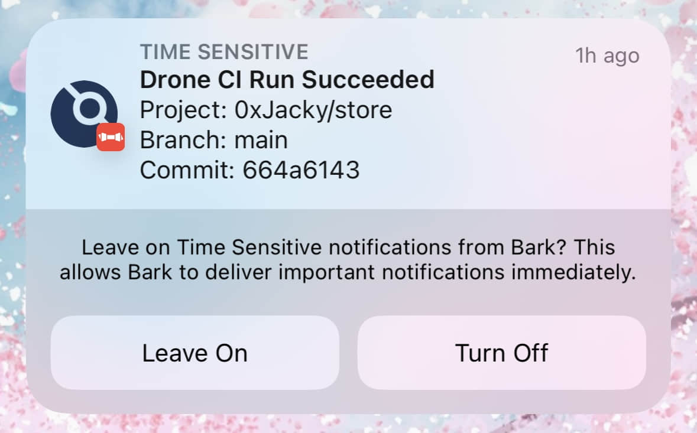

# Drone-bark
A plugin to Drone plugin for sending Bark notifications.



# Usage

The following settings changes this plugin's behavior.

* server_url (optional) sets the bark server url.
* bark_device (required) sets the bark device key.
* icon (optional) sets the notification icon in iOS.
* group (optional) sets the notification group.
* bark_level (optional) sets the notification level
    - active: default, system will display notification immediately.
    - timeSensitive: bark will send a time sensitive message which can display in focus mode.
    - passive: bark will only add this message to the notification list without turn the screen on.
* sound (optional) sets bark notification sound.

Below is an example `.drone.yml` that uses this plugin.

```yaml
kind: pipeline
name: default

steps:
- name: run 0xJacky/drone-bark plugin
  image: 0xJacky/drone-bark
  pull: if-not-exists
  settings:
    server_url: foo
    bark_device: 
      from_secret: bark_device
    icon: foobar
    bark_group: Drone CI
    bark_level: active
    bark_sound: silence
```

# Building
```text
docker build -t 0xJacky/drone-bark .
```

# Testing

Execute the plugin from your current working directory:

```text
docker run --rm -e PLUGIN_SERVER_URL=foo -e PLUGIN_BARK_DEVICE=bar \
  -e PLUGIN_ICON=foo -e PLUGIN_BARK_GROUP=Drone\ CI \
  -e PLUGIN_BARK_LEVEL=timeSensitive -e PLUGIN_BARK_SOUND=minuet \
  -e DRONE_COMMIT_SHA=8f51ad7884c5eb69c11d260a31da7a745e6b78e2 \
  -e DRONE_COMMIT_BRANCH=master \
  -e DRONE_BUILD_NUMBER=43 \
  -e DRONE_REPO_NAMESPACE=0xJacky \
  -e DRONE_REPO_NAME=drone-bark
  -e DRONE_BUILD_STATUS=success \
  -w /drone/src \
  -v $(pwd):/drone/src \
  0xJacky/drone-bark
```
